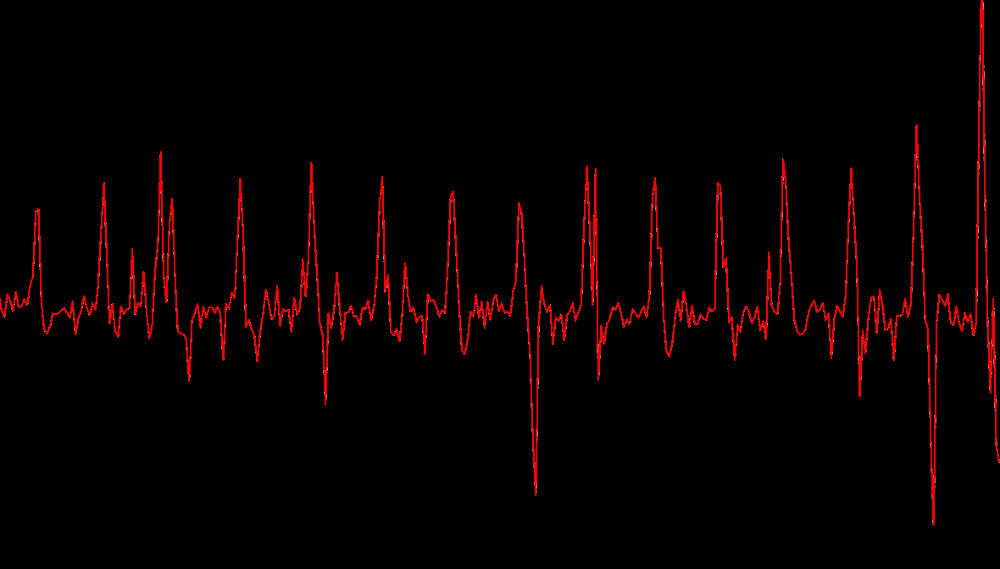

# CV-HeartRate

An opensource project that measures real time heart rate.

## Why The Heck do I Need this?
* Realtime heart rate monitoring
* Arduino, ESP, Wemos Projects
* Fixed Heart Beat Sensor 
* I have a dedicated server for IoT for CPU/GPU intensive tasks (The house of FUTURE!!)

## Installation
* Grab this project from git

## How Does it Work?


**Step 1:**
Assumptions:

* Finger on the camera.
* Flashlight is on.

**Step 2:**
Calculate Image brightness over time.

**Step 3:** 

Calculate derivatives and find wavelength, that is time between R-R Peak.

**Step 4:** 

Drop values with similar standard deviation (Trust me you don't want heart beat of 600 bpm :D )


# Examples

## Local Files
```python

from heartbeat import HeartBeat

beat = HeartBeat("3gp/mp4/whatever")
beat.get_brightness_from_video()
beat = beat.analyze_heart_beat()

print(beat)
```

## Video Streams
```python

from heartbeat import CamBeat

beat = CamBeat("3gp/mp4/whatever")
beat.get_brightness_from_video()
beat = beat.analyze_heart_beat()

print(beat)
```

How it sees your heart beat.



# Camdroid

Just fire up the app on android and get it's ip.